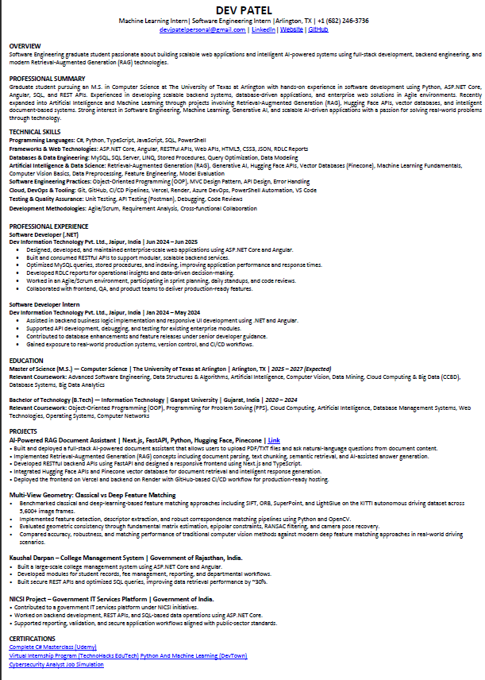
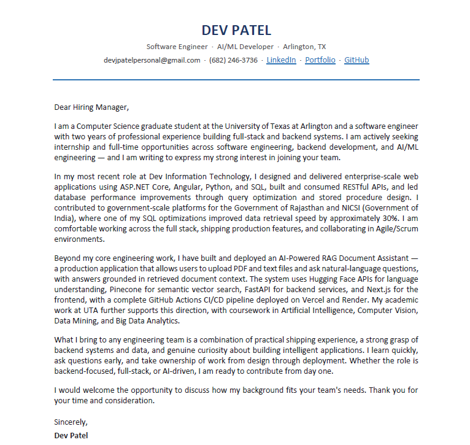

# Hi, I'm Dev Patel 👋

Software Engineer & ML Enthusiast  
MS Computer Science @ UT Arlington

---

## 🚀 About Me

- Full-Stack Developer with experience in ASP.NET Core, Angular, Python, SQL, and REST APIs
- AI & RAG Enthusiast building intelligent document-based systems
- Interested in Machine Learning, Computer Vision, Generative AI, and scalable backend systems
- Currently pursuing M.S. in Computer Science at The University of Texas at Arlington

---

## 🛠 Tech Stack

Python • C# • ASP.NET Core • Angular • Next.js • FastAPI • SQL • Pinecone • Hugging Face • OpenCV • REST APIs • GitHub • Vercel • Render

---

## 🔥 Featured Projects

### AI-Powered RAG Document Assistant

Full-stack AI document assistant that allows users to upload PDF/TXT files and ask questions using Retrieval-Augmented Generation (RAG) concepts and intelligent document retrieval.

**Tech Stack:** Next.js · FastAPI · Python · Hugging Face · Pinecone · Vercel · Render

---

### Multi-View Geometry: Classical vs Deep Feature Matching

Benchmarked SIFT, ORB, SuperPoint, and LightGlue on KITTI driving data across 5,600+ frames for feature matching, fundamental matrix estimation, epipolar geometry, and camera pose recovery.

**Tech Stack:** Python · OpenCV · LightGlue · KITTI · RANSAC

---

## 📄 Resume Preview

  

---

## 📝 Cover Letter Preview

  

---

## 📊 GitHub Stats

  

  

---

## 🔥 GitHub Streak

  

---

## 🐍 Contribution Snake

  <picture>
    <source media="(prefers-color-scheme: dark)" srcset="https://raw.githubusercontent.com/devjpatell/devjpatell/output/github-contribution-grid-snake-dark.svg">
    <source media="(prefers-color-scheme: light)" srcset="https://raw.githubusercontent.com/devjpatell/devjpatell/output/github-contribution-grid-snake.svg">
    
  </picture>

---

## 🌐 Connect With Me

  

  

  

